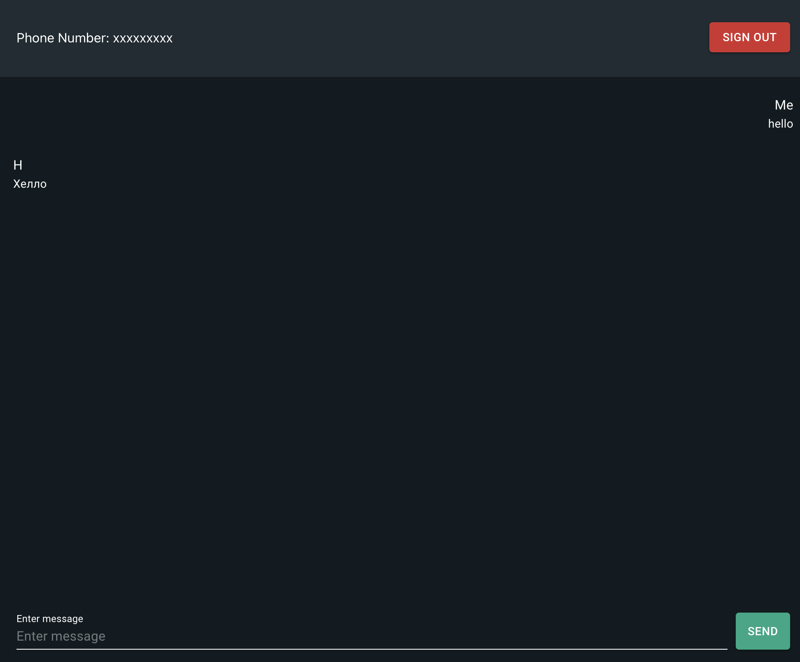
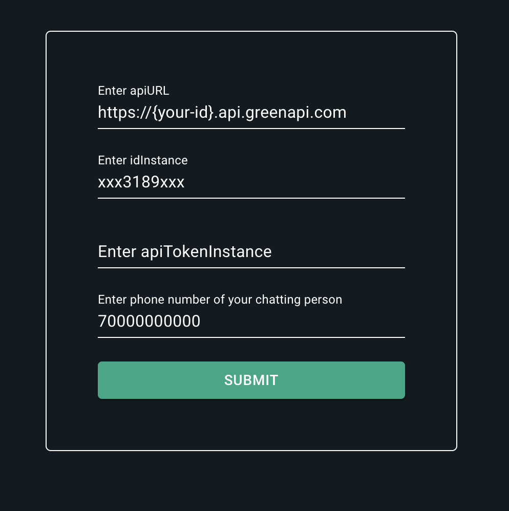

## 🚀 Quick Start

### Prerequisites

- Install [Node.js](https://nodejs.org)
- Terminal `bash/powershell` to install dependencies and run

## 📸 Screenshot



## 📦 Build/Create

1. **Load npm dependencies**

   ```shell
   npm install
   ```

2. **Start**

   ```shell
   npm run start
   ```

## 🎮 Usage

1. **Enter your credentials and phone number**

- Open [localhost](http://localhost:3000/) if not opened when `npm run start` script runned.
- Enter your credentials and phone number



2. **Just chat**

- just chat

### Hint

- you can create `.env` file and fill values w/ your data
- this will pre populate enter form

```
REACT_APP_API_URL=
REACT_APP_ID_INSTANCE=
REACT_APP_API_TOKEN_INSTANCE=
REACT_APP_PHONE_NUMBER=
```

### Powered

- [Create React App](https://create-react-app.dev/)
- [Green API Documentation](https://green-api.com/docs/)
